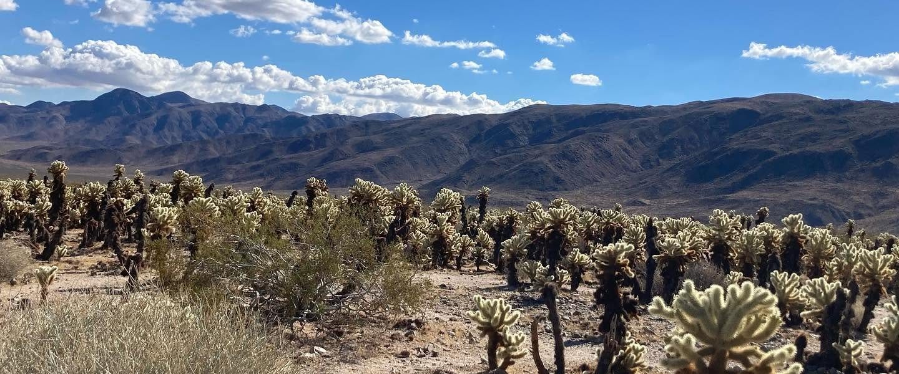

```{=html}

```

::: {.greeting}
Hi, I'm Div!
:::

I am an Assistant Professor of Economics at the College of Business and Economics, California State University, Fullerton. I received my Ph.D. in Economics from Boston College in 2022.

::: {.fields-label}
Research fields
:::

::: {.interest-tags}
[Labor Economics]{} [Applied Econometrics]{}
:::

You can find my published and working papers on the [research](research.qmd) page. Materials from the classes I teach at CSUF are on the [teaching](teaching.qmd) page.

I'm always happy to hear from fellow researchers and students. Reach me at [dbhagia@fullerton.edu](mailto:dbhagia@fullerton.edu) or [dbhagia17@gmail.com](mailto:dbhagia17@gmail.com).
